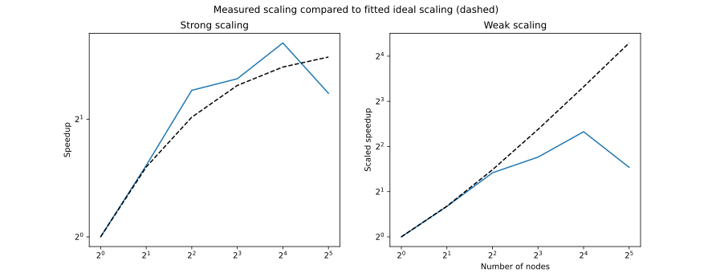

# HYDRO | Hybrid

This is the HYBRID version of the hydro project.

## Compiling

Run make from the ``/Bin`` folder in order to compile the project. Depending on the environment, the field ``F90`` in the ``Bin/Makefile`` needs to be set to ``F90 = mpifort`` or ``F90 = gfortran``.

## Visualize

Execute the ``Output/render_sequence.py`` script. It will automaticially render all output files and stitch together the outputs from the MPI ranks. The script takes the number of processors as argument. e.g: ``python render_sequence.py 4``

## Speedup

Fitted parameters for dashed lines:
- Amdahl: p = 0.87, s = 0.13
- Gustav: p = 0.46, s = 0.54

The measurements were perfomed on cscs. Hypethreading was turned on and the multicore partition was used, resulting in 72 OpenMP threads.

### Reproduce measurements

1. Set ``ptest = .TRUE.`` in ``hydro_commun``
2. Run ``make`` inside ``/Bin``
3. Run ``Analysis/analysis.sh`` (only works for slurm environments)
4. Run ``python Analysis/plot_analysis.py`` to plot the results
