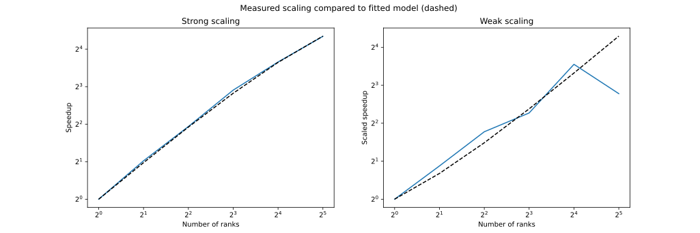

# HYDRO | MPI #

This is the MPI version of the hydro project. 

## Comile & Run

Run ``make`` from the ``/Bin`` folder in order to compile the project. Depending on the environment ``F90`` in the makefile needs to be set to ``F90 = mpifort`` or ``F90 = gfortran``. When using ``F90 = mpifort`` the simulation can be executed with ``mpirun ./hydro``.

## Visualize 

Execute the render_sequence.py script from the ``/Output`` folder. It will automaticially render all output files and stitch together the outputs from the different processors. The script takes the number of processors as argument. e.g: ``python simple_mpi.py 4``

## Main functions

- The function ``init_mpi`` initializes a 2D cartesian grid which makes sure processors are aware of their neighbours and know their slabsize.
- The function ``init_surround`` defines the mpi subarray types which allows to send 2D array between different processors. This is neceassary since we are splitting the full domain in two axes, therefore we cannot only send columns (fortran is column major).
- The function ``get_surround`` fetches the surrounding cells from other processors along the defined axis. 

## Speedup plots

Fitted parameters for dashed lines:

- Amdahl: p = 0.97, s = 0.03
- Gustav: p = 0.43, s = 0.56

### Reproduce measurements

1. Set ``ptest = .TRUE.`` in ``hydro_commun``
2. Run ``make`` from the ``Bin`` directory
3. Run ``Analysis/analysis.sh`` (only works for slurm environments)
4. Run ``python plot_analysis.py`` inside the ``Analysis`` directory

## Single Node Execution Time 

### Reproduce measurements

1. Set ``ptest = .TRUE.`` in ``hydro_commun``
2. Run ``make`` from the ``Bin`` directory
3. Run ``Analysis/analysis.single.sh`` (only works for slurm environments)
4. Run ``python plot_analysis_single.py`` inside the ``Analysis`` directory