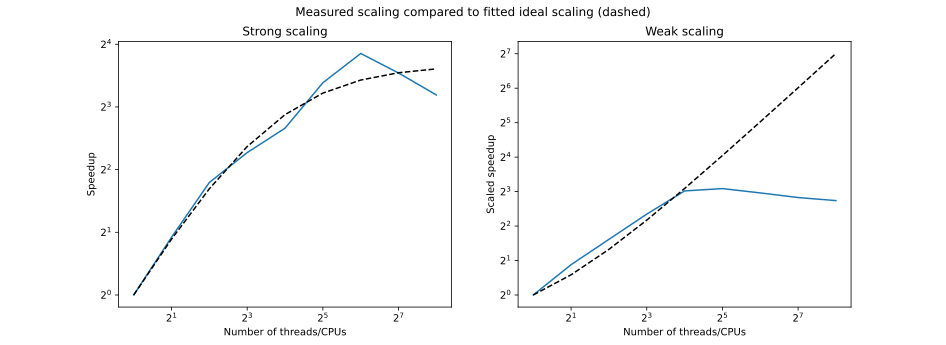

# HYDRO | OpenMP

This is the OpenMP version of the hydro project.

## Compile & Run

Run make from the /Bin folder in order to compile the project. 

## Visualize

Execute the render_sequence.py script from the ``/Output`` folder. e.g. ``python render_sequence.py``

## Speedup plots

Fitted parameters for dashed lines:

- Amdahl: p = 0.85, s = 0.15
- Gustav: p = 0.6, s = 0.4

### Reproduce measurements

1. Set ``ptest = .TRUE.`` in ``hydro_commun``
2. Run ``make`` from the ``Bin`` directory
3. Run ``Analysis/analysis.sh`` (only works for slurm environments)
4. Run ``python plot_analysis.py`` inside the ``Analysis`` directory

## Single node execution time

### Reproduce measurements

1. Set ``ptest = .TRUE.`` in ``hydro_commun``
2. Run ``make`` from the ``Bin`` directory
3. Run ``Analysis/analysis.single.sh`` (only works for slurm environments)
4. Run ``python plot_analysis_single.py`` inside the ``Analysis`` directory
